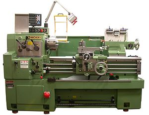
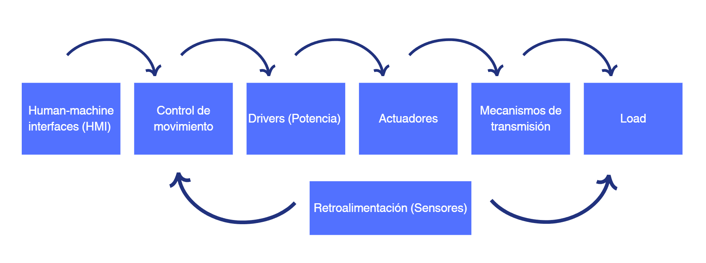
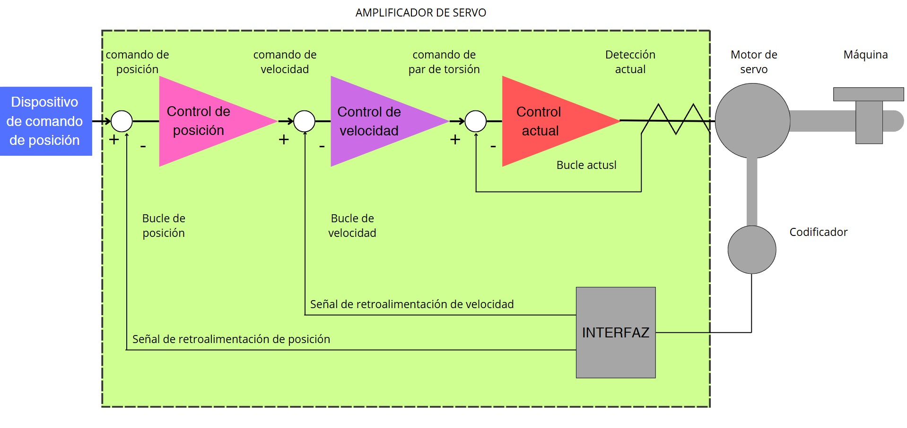

# Control de Movimiento

El control de movimiento consiste en gestionar el movimiento mecánico de una carga. 

## Industrias de aplicación
- Empaque
- Ensamblaje
- Impresión
- Productos de madera
- Maquinaria
- Electrónica y semiconductores

## Ejes de movimiento
Eje (axis): Movimiento realizado por un actuador. 
Se pueden tener varios ejes de control para realizar una tarea.

## Variables a controlar
- Posición
- Velocidad
- Torque
- Aceleración

## Ejemplo CNC
Los sistemas de control de movimiento son fundamentales en máquinas CNC para realizar cortes y movimientos de precisión. Anteriormente, se usaba un único motor con un eje largo y diferentes engranajes para cambiar trayectorias y velocidades. Este método es menos flexible y más costoso en mantenimiento.  

### Ejemplo
- Máquina Dobladora
- Máquina Etiquetadora

## Componentes del control de movimiento

## Características del control

- Cuando el motor mueve una carga, aparece una fuerza en sentido contrario que afecta su velocidad. Para evitar problemas, hay que ajustar bien el torque y hacerlo de forma rápida y suave.  
- El control de velocidad debe ser preciso para seguir trayectorias con exactitud.  
- Es importante diseñar bien el controlador de potencia para ahorrar energía y prolongar la vida útil del motor y la electrónica.  

## Esquema de control
### Lazo en cascada

## Aplicaciones prácticas
- **Transporte**: Cadenas de suministro automatizadas.
- **Maquinaria de bobinado**: Cortadoras y laminadoras.
- **Productos alimenticios**: Procesos automatizados.
- **Fabricación de semiconductores**: Aplicaciones fotográficas en wafers.
- **Ensamble de componentes electrónicos**.

## Ejemplos adicionales
### **Brazo robótico**  
Un robot de ensamblaje usa **control de movimiento** para posicionar piezas con precisión. Para lograrlo, se implementan los siguientes mecanismos de control:  

- **Control de posición y trayectoria:** Se utilizan servomotores y sensores para asegurar que el brazo se mueva a la posición exacta con alta repetibilidad.  
- **Control de velocidad y aceleración:** Se ajustan los perfiles de velocidad para evitar movimientos bruscos que puedan dañar las piezas o reducir la eficiencia del ensamblaje.  
- **Control de torque:** Se regula la fuerza ejercida por los motores para manipular diferentes tipos de piezas sin dañarlas.  
- **Realimentación sensorial:** Sensores ópticos y táctiles verifican que las piezas estén correctamente colocadas y permiten correcciones en tiempo real.  

### **Sistema de riego automatizado**  
Un mecanismo controla el desplazamiento de los rociadores en una plantación mediante diferentes sistemas de control:  

- **Control de posición y desplazamiento:** Se utilizan actuadores para mover los rociadores según un patrón predefinido que maximiza la cobertura de agua.  
- **Control de caudal y presión:** Sensores de flujo y presión ajustan la cantidad de agua suministrada para evitar el desperdicio y garantizar una irrigación uniforme.  
- **Control basado en datos ambientales:** Sensores de humedad del suelo y estaciones meteorológicas ajustan el riego según las condiciones climáticas, optimizando el consumo de agua.  
- **Automatización con control en lazo cerrado:** La información en tiempo real permite corregir errores y ajustar el sistema sin intervención humana, asegurando una irrigación eficiente y precisa.  

## Conclusiones
- El control de movimiento es clave en la automatización industrial.
- Permite mejorar la precisión, eficiencia y flexibilidad de los sistemas mecánicos.
- La implementación de lazos de control mejora la estabilidad y el rendimiento.

## Referencias
- Ogata, K. *Ingeniería de control moderna*.
- Chen. *Diseño de sistemas de control analógicos y digitales*.
- Astrom, K. *Controladores PID: Teoría, diseño y sintonización*.
